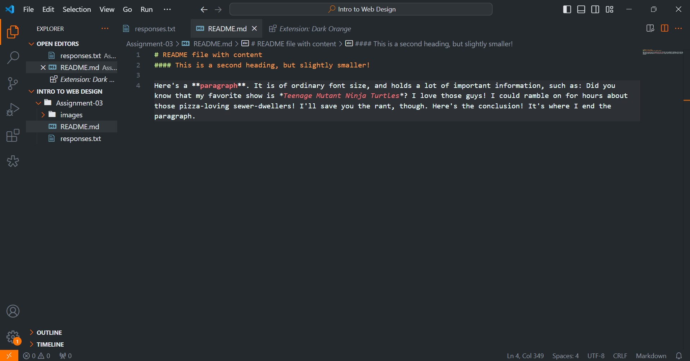

# README file with content
#### This is a second heading, but slightly smaller!

Here's a **paragraph**. It is of ordinary font size, and holds a lot of important information, such as: Did you know that my favorite show is *Teenage Mutant Ninja Turtles*? I love those guys! I could ramble on for hours about those pizza-loving sewer-dwellers! I'll save you the rant, though. Here's the conclusion! It's where I end the paragraph.

[I'm the link to the responses page!](./responses.txt)

